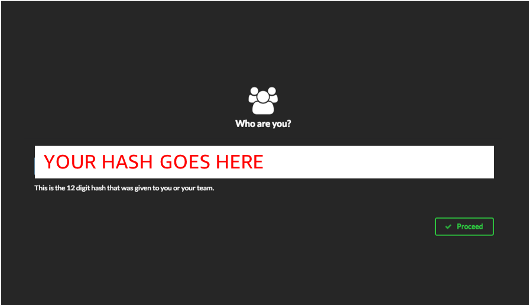
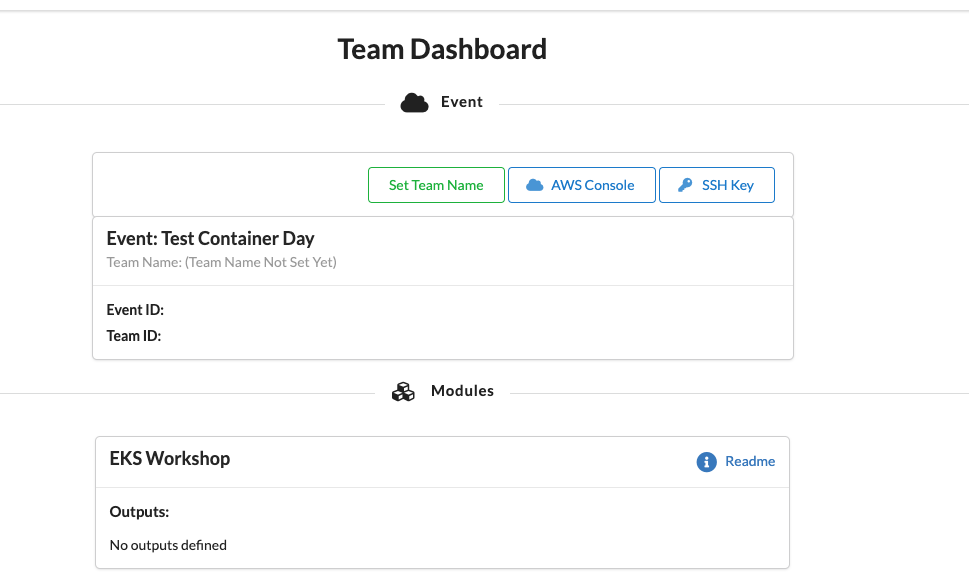
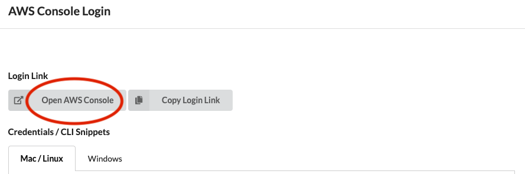
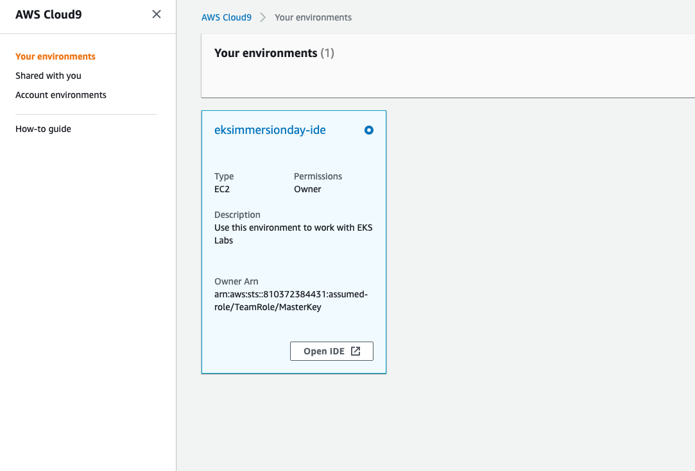
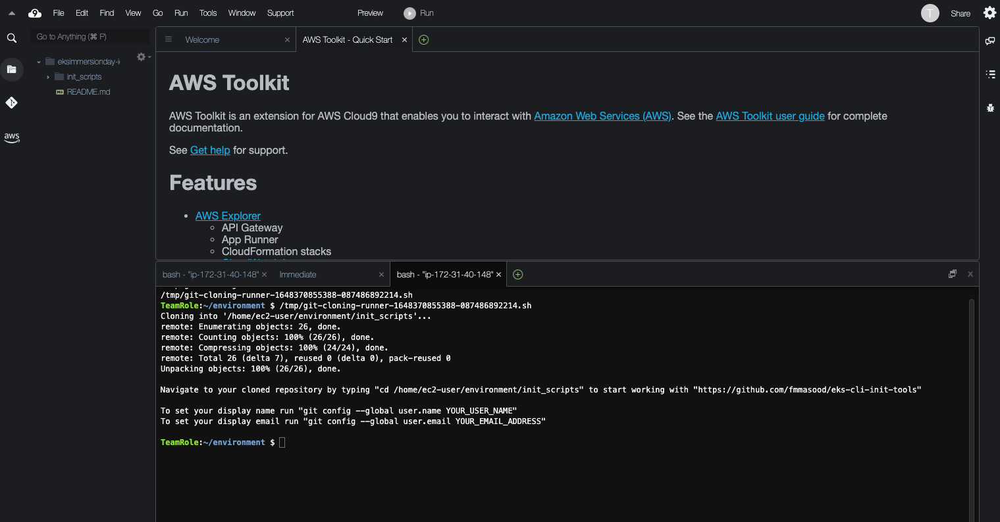

### Connecting to the AWS Event Engine

To help you get hands-on as quickly as possible the AWS Container Immersion Day team has pre-created you AWS environment. 
You will need the **participant hash**, which should have been provided upon entry, and your email address to track your unique session.
Connect to the AWS Event Engine by browsing to https://dashboard.eventengine.run/ .

Enter your unique hash and the click on **proceeed**.



Click on the **AWS Console** button.



Click on the **Open Console** button to launch the AWS Management Console.




### Launching the Cloud9 IDE

Today you'll be working in the AWS Cloud9 IDE.

We've pre-created one Cloud9 workspace for you, Let's get started by launching the AWS Cloud9 console: [AWS Cloud9 console](https://console.aws.amazon.com/cloud9/)

Find the workspace named **eksimmersionday-ide** and click Open IDE:



When you open the **eksimmersionday-ide** workspace, you'll be presented with a welcome screen that looks something like this:



Execute following commands in your terminal to download required tools like helm, kubescape, eksctl and setup your account.

```bash 
chmod +x ./init_scripts/cli_tools.sh 
cd init_scripts/
./cli_tools.sh
cd ..
source ~/.bash_profile
```

### Confirm Setup 

You can test access to your cluster by running the following command. The output will be a list of worker nodes

```bash
echo $ACCOUNT_ID
echo $AWS_REGION
kubectl get nodes
```

