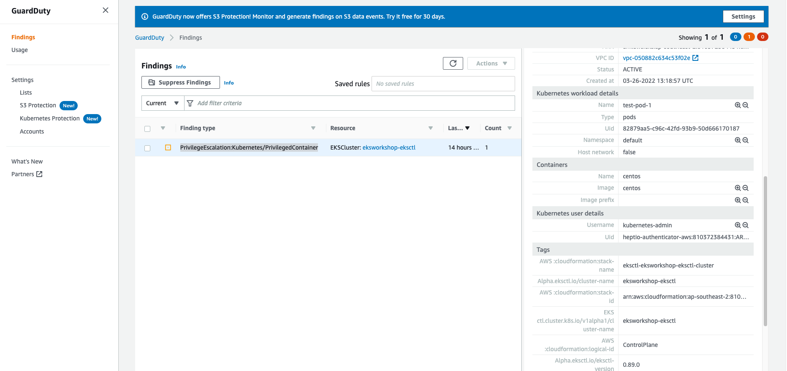
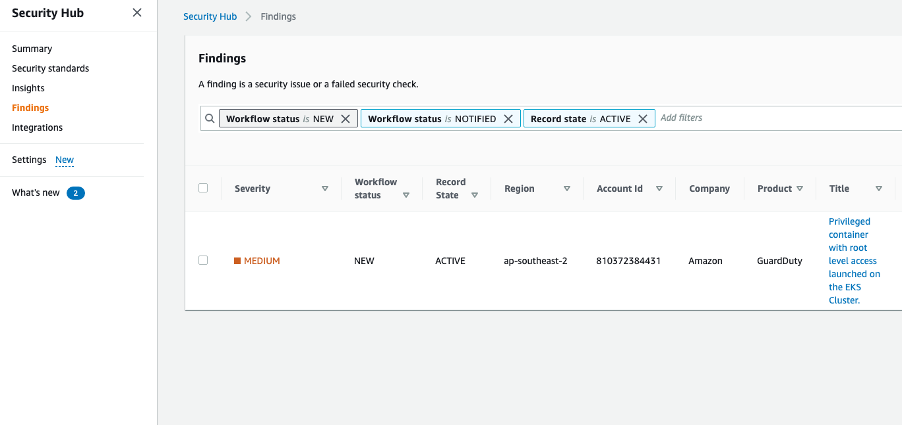

### Objective 

In this lab we will deploy a Privileged pod. We have enabled Guard Duty to continuously monitor and profile Amazon Elastic Kubernetes Service (Amazon EKS) cluster activity to identify malicious or suspicious 
behavior that represents potential threats to container workloads. 

For a complete list of EKS protection currently available for Guard Duty click [here](https://docs.aws.amazon.com/guardduty/latest/ug/guardduty_finding-types-kubernetes.html).


1. Create manifest to deploy centos. Note: privileged is set to true inside the security context. 

```bash 
cat << EoF > privileged-pod.yaml
apiVersion: v1
kind: Pod
metadata:
  name: test-pod-1
  namespace: default
spec:
  containers:
  - name: centos
    image: centos
    command: ['sh', '-c', 'sleep 999']
    securityContext:
       privileged: true
EoF
```

2. Deploy the pod

```bash 
kubectl apply -f privileged-pod.yaml
```

3. Check status of the pod 

```bash
kubectl get pods

NAME         READY   STATUS    RESTARTS   AGE
test-pod-1   1/1     Running   0          48s

```


4. Navigate to GuardDuty in your AWS Console, and click on findings on the left hand side menu. You should **PrivilegeEscalation:Kubernetes/PrivilegedContainer** listed there. Click on finding to view cluster and workload details. 
**Note**: It can take upto 15 minutes for the findings to appear in console.



5. You will also see this listed under Security Hub. 




6. Cleanup. Delete privileged pod by executing following command in your Cloud9 console. 

```bash
kubectl delete -f privileged-pod.yaml
```


