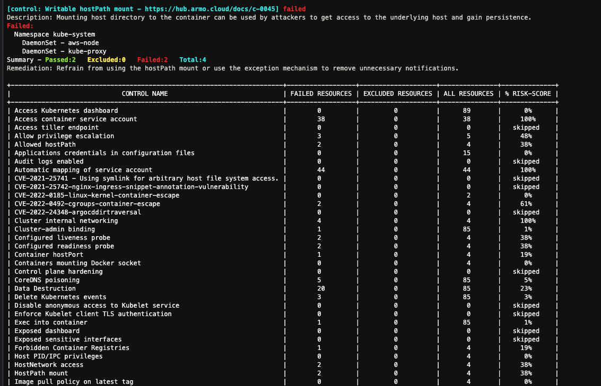
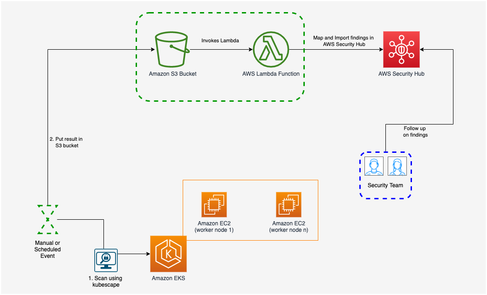
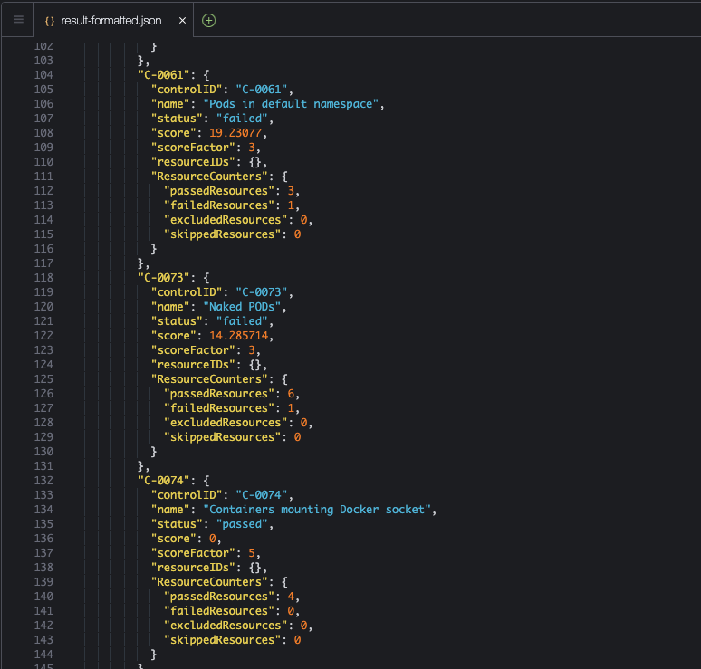
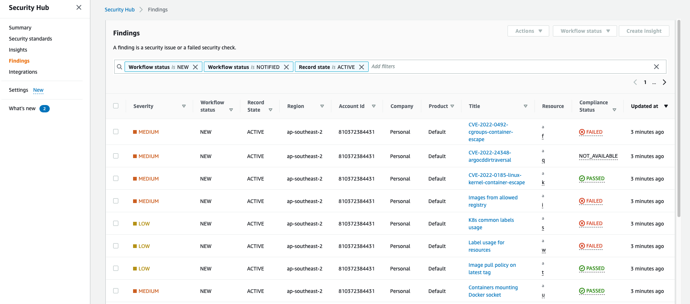
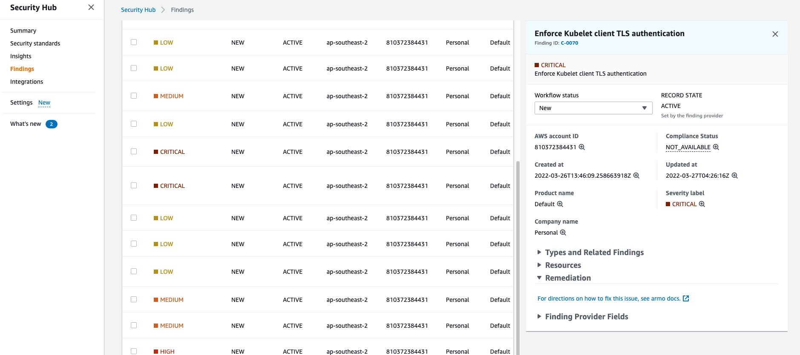

### Objective

In this lab we will use [kubescape](https://github.com/armosec/kubescape), an open-source tool to scan our EKS cluster. We will then export these findings to 
security hub by making use of its ability to consume findings that are generated by other custom security products (for example, kubescape).

1. kubescape should already be installed as part of lab setup. Validate kubescape setup by executing following command;

```bash 
kubescape -v
kubescape version v2.0.149
```

2. Execute a scan. You should see some activity in the terminal followed by summary of findings;

```bash
kubescape scan
```




3. At present, there is no out of box integration between kubescape and Security Hub. We have deployed a Lambda function to map kubescape findings to security hub. 
We also have created an S3 bucket to store these findings, which will trigger Lambda function (on object create) to import them in Security Hub. You can list
S3 bucket and Lambda function by executing following command;

```bash 
aws s3 ls 
aws lambda list-functions --query Functions[*].FunctionName
```

**Note:** S3 and Lambda function with kubescape in the name. We will need this to import findings in S3. 

4. Here is an overview of how end to end integration works for importing kubescape findings in Security Hub. 





5. In order to export this to security hub, we need findings in a format that can be consumed by our custom code. Execute following command
   to scan and export findings in json.

```bash 
kubescape scan --format json --format-version v2 --output results.json
```

6. Format generated findings (json pretty format) so we can view them in Cloud9 console. Once formatted, open the file in Cloud9.

```bash
jq . results.json >> result-formatted.json
```



7. Upload these findings to S3 bucket

```bash 
aws s3 cp results.json s3://kubescape-securityhub-${AWS_REGION}-${ACCOUNT_ID}
```

8. Navigate to GuardDuty in your AWS Console, and click on findings on the left hand side menu. 




9. Click on fingins title to view details.



10. Lets have a look at the lambda function code, to see how these are mapped from kubescape to security hub format


```python

import json
import boto3
import os
import random
import string
from datetime import datetime

s3_client = boto3.client('s3')
securityhub_client = boto3.client('securityhub')


def lambda_handler(event, context):

    #print('Incoming Event: {0}'.format(event))
    current_account_id = os.environ['current_account_id']
    current_region = os.environ['current_region']

    bucket_name = event['Records'][0]['s3']['bucket']['name']
    object_key = event['Records'][0]['s3']['object']['key']

    current_date_time = datetime.now()

    get_object_response = s3_client.get_object(
        Bucket=bucket_name,
        Key=object_key
    )

    payload = json.loads( get_object_response['Body'].read() )
    kubescape_controls = payload['summaryDetails']['controls']
    findings_generation_time =  payload['generationTime']

    findings = []

    for control in kubescape_controls:
        obj = kubescape_controls[control]

        #print("control_id: {0}, control_status:{1}".format(obj['controlID'], obj['status'].upper()))

        compliance_status = obj['status'].upper()
        score_factor = obj['scoreFactor'] * 10

        if score_factor in range (1,39):
            severity_label = "LOW"
        elif score_factor in range (40,69):
            severity_label = "MEDIUM"
        elif score_factor in range (70,89):
            severity_label = "HIGH"
        else:
            severity_label = "CRITICAL"

        if compliance_status not in ['PASSED', 'FAILED']:
            compliance_status = "NOT_AVAILABLE"

        #print("compliance_status: {0}".format(compliance_status))
        #print("score_factor: {0} compliance_status: {1}".format(score_factor, severity_label))

        findings.append(
            {
                "SchemaVersion": "2018-10-08",
                "Id": obj['controlID'],
                "ProductArn": "arn:aws:securityhub:{0}:{1}:product/{1}/default".format(current_region, current_account_id),
                "GeneratorId": context.invoked_function_arn,
                "AwsAccountId": current_account_id,
                "Types": [
                    "Software and Configuration Checks/AWS Config Analysis"
                ],
                "Severity": {
                    "Label": severity_label,
                    "Original": str(obj['scoreFactor'])
                },
                "Title": obj['name'],
                "Description": obj['name'],
                "CreatedAt": findings_generation_time,
                "UpdatedAt": current_date_time.strftime("%Y-%m-%dT%H:%M:%SZ"),

                "Remediation": {
                    "Recommendation": {
                        "Text": "For directions on how to fix this issue, see armo docs.",
                        "Url": "https://hub.armo.cloud/docs/" + obj['controlID'].lower()
                    }
                },
                "Resources": [
                    {
                        "Id": random.choice(string.ascii_lowercase),
                        "Type": "a",
                        "Partition" : "aws",
                        "Region": current_region
                    }
                ],
                'Compliance': {'Status': compliance_status}
            }

        )


    if len(findings) > 0:
        batch_import_findings_response = securityhub_client.batch_import_findings(
            Findings=findings
        )

    print("Findings: {0}".format(json.dumps(findings)) )
    print("Failed to import {0} findings".format(batch_import_findings_response['FailedCount']))
    print("Successfully imported {0} findings".format(batch_import_findings_response['SuccessCount']))

    return {
        'statusCode': 200,
        'body': json.dumps({
            "SuccessCount": batch_import_findings_response['SuccessCount'],
            "FailedCount": batch_import_findings_response['FailedCount']
        })
    }


```