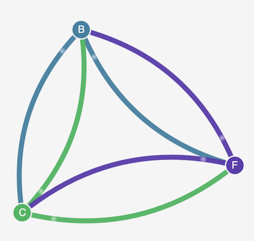
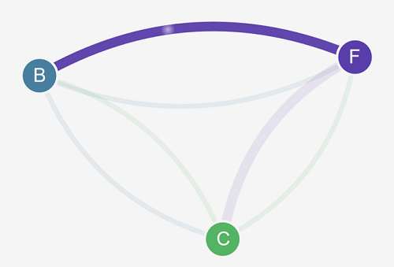
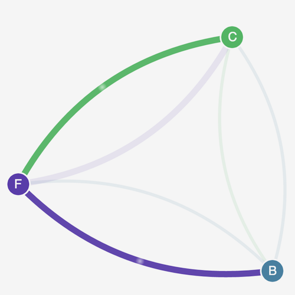

### Objective

In this lab we will walk through Stars policy demo provided by the project Calico. The demo creates a front-end, back-end, and client service on your Amazon EKS cluster. 
The demo also creates a management graphical user interface that shows the available ingress and egress paths between each service. We recommend that you complete the demo on a cluster that you don't run production workloads on.

#### Install Calico
a. Apply the Calico manifests to your cluster. These manifests create a DaemonSet in the calico-system namespace.

```bash
kubectl apply -f https://raw.githubusercontent.com/aws/amazon-vpc-cni-k8s/master/config/master/calico-operator.yaml
kubectl apply -f https://raw.githubusercontent.com/aws/amazon-vpc-cni-k8s/master/config/master/calico-crs.yaml
```

View the resources in the calico-system namespace.

```bash
kubectl get daemonset calico-node --namespace calico-system
```

Output

The values in the DESIRED and READY columns should match. 

```bash
NAME          DESIRED   CURRENT   READY   UP-TO-DATE   AVAILABLE   NODE SELECTOR            AGE
calico-node   1         1         1       1            1           kubernetes.io/os=linux   26m
```

Before you create any network policies, all services can communicate bidirectionally. After you apply the network policies, you can see that the client can only communicate with the front-end service, and the back-end only accepts traffic from the front-end.

1. Apply the front-end, back-end, and client interface services.

```bash 
kubectl apply -f https://docs.projectcalico.org/v3.5/getting-started/kubernetes/tutorials/stars-policy/manifests/00-namespace.yaml
kubectl apply -f https://docs.projectcalico.org/v3.5/getting-started/kubernetes/tutorials/stars-policy/manifests/02-backend.yaml
kubectl apply -f https://docs.projectcalico.org/v3.5/getting-started/kubernetes/tutorials/stars-policy/manifests/03-frontend.yaml
kubectl apply -f https://docs.projectcalico.org/v3.5/getting-started/kubernetes/tutorials/stars-policy/manifests/04-client.yaml
```

2. Apply management user interface services.

```bash 

cat << EoF > 01-management-ui.yaml
apiVersion: v1
kind: Namespace
metadata:
  name: management-ui
  labels:
    role: management-ui
---
apiVersion: v1
kind: Service
metadata:
  name: management-ui
  namespace: management-ui
spec:
  type: LoadBalancer
  ports:
    - port: 9001
      targetPort: 9001
      nodePort: 30002
      protocol: TCP
  selector:
    role: management-ui
---
apiVersion: v1
kind: ReplicationController
metadata:
  name: management-ui
  namespace: management-ui
spec:
  replicas: 1
  template:
    metadata:
      labels:
        role: management-ui
    spec:
      containers:
        - name: management-ui
          image: calico/star-collect:v0.1.0
          imagePullPolicy: Always
          ports:
            - containerPort: 9001
EoF

kubectl apply -f 01-management-ui.yaml
```

3. View all pods on the cluster.

```bash 
kubectl get pods -A

```

4. To connect to the management user interface, get the load balancer url.

```bash
kubectl get svc management-ui -n management-ui -o jsonpath="{.status.loadBalancer.ingress[*].hostname}" 
```

5. Open a browser on your local system and point it to http://<loadbalancer-url-from-step4>:9001/. You should see the management user interface. The C node is the client service, the F node is the front-end service, and the B node is the back-end service. Each node has full communication access to all other nodes, as indicated by the bold, colored lines.




6. Apply the following network policies to isolate the services from each other:

```bash
kubectl apply -n stars -f https://docs.projectcalico.org/v3.5/getting-started/kubernetes/tutorials/stars-policy/policies/default-deny.yaml
kubectl apply -n client -f https://docs.projectcalico.org/v3.5/getting-started/kubernetes/tutorials/stars-policy/policies/default-deny.yaml
```


7. Refresh your browser. You see that the management user interface can no longer reach any of the nodes, so they don't show up in the user interface.


8. Apply the following network policies to allow the management user interface to access the services:

```bash
kubectl apply -f https://docs.projectcalico.org/v3.5/getting-started/kubernetes/tutorials/stars-policy/policies/allow-ui.yaml
kubectl apply -f https://docs.projectcalico.org/v3.5/getting-started/kubernetes/tutorials/stars-policy/policies/allow-ui-client.yaml 
```

9. Refresh your browser. You see that the management user interface can reach the nodes again, but the nodes cannot communicate with each other.


10, Apply the following network policy to allow traffic from the front-end service to the back-end service:

```bash
kubectl apply -f https://docs.projectcalico.org/v3.5/getting-started/kubernetes/tutorials/stars-policy/policies/backend-policy.yaml

```

11. Refresh your browser. You see that the front-end can communicate with the back-end.




12. Apply the following network policy to allow traffic from the client to the front-end service.

```bash
kubectl apply -f https://docs.projectcalico.org/v3.5/getting-started/kubernetes/tutorials/stars-policy/policies/frontend-policy.yaml
```

13. Refresh your browser. You see that the client can communicate to the front-end service. The front-end service can still communicate to the back-end service.




#### Clean Up

14. When you are done with the demo, delete its resources.

```bash
kubectl delete -f https://docs.projectcalico.org/v3.5/getting-started/kubernetes/tutorials/stars-policy/manifests/04-client.yaml
kubectl delete -f https://docs.projectcalico.org/v3.5/getting-started/kubernetes/tutorials/stars-policy/manifests/03-frontend.yaml
kubectl delete -f https://docs.projectcalico.org/v3.5/getting-started/kubernetes/tutorials/stars-policy/manifests/02-backend.yaml
kubectl delete -f https://docs.projectcalico.org/v3.5/getting-started/kubernetes/tutorials/stars-policy/manifests/00-namespace.yaml
kubectl delete -f 01-management-ui.yaml
```

 

```bash
kubectl delete -f https://raw.githubusercontent.com/aws/amazon-vpc-cni-k8s/master/config/master/calico-crs.yaml
kubectl delete -f https://raw.githubusercontent.com/aws/amazon-vpc-cni-k8s/master/config/master/calico-operator.yaml
```