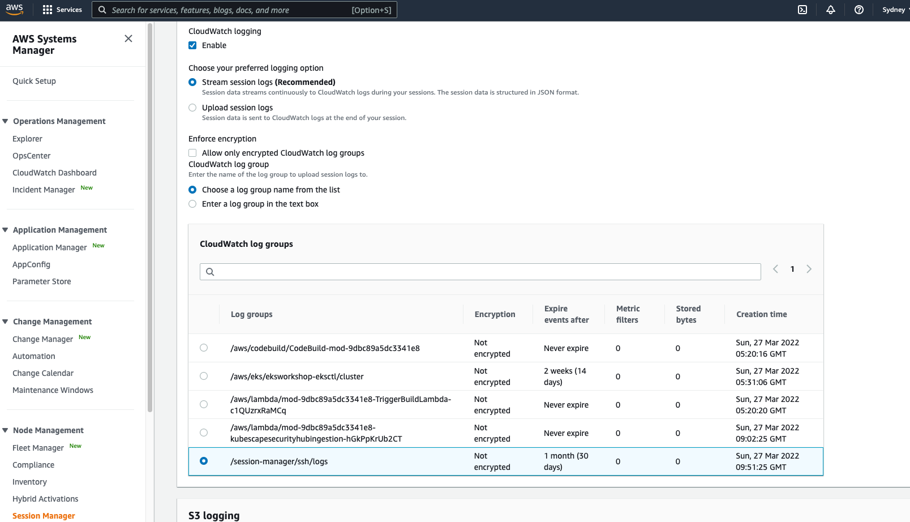

# Enable SSH session logging through AWS Session Manager
Instead of enabling direct SSH access, use SSM Session Manager when you need to remote into an eks worker node or any EC2 instance.
In this section we will see how to stream ssh access logs to cloudwatch using AWS System Manager - Session Manager.

1. Create a new log group 

```bash
aws logs create-log-group --log-group-name /session-manager/ssh/logs
aws logs put-retention-policy --log-group-name /session-manager/ssh/logs --retention-in-days 30
```

2. Navigate to [AWS System Manager](https://ap-southeast-2.console.aws.amazon.com/systems-manager) in your AWS console.


4. From System Manager navigate to Session Manager 


5. Click on Configure preferences. On next screen, configure logs to be streamed to cloudwatch log group just created. Click Save.



6. Connect to a Kubernetes Worker node through EC2 console, and execute commands


7. View SSH logs in CloudWatch. 


### Analyze logs with Log Insights
Use CloudWatch Log Insights to monitor changes to RBAC objects, e.g. Roles, RoleBindings, ClusterRoles, and ClusterRoleBindings.

1. List of failed anonymous requests:

```
fields @timestamp, @message, sourceIPs.0
| sort @timestamp desc
| limit 100
| filter user.username="system:anonymous" and responseStatus.code in ["401", "403"]
```


2. Lists updates to the `aws-auth` ConfigMap:

```
fields @timestamp, @message
| filter @logStream like "kube-apiserver-audit"
| filter verb in ["update", "patch"]
| filter objectRef.resource = "configmaps" and objectRef.name = "aws-auth" and objectRef.namespace = "kube-system"
| sort @timestamp desc
```

**Note:** You should be able to track changes made in previous labs.

